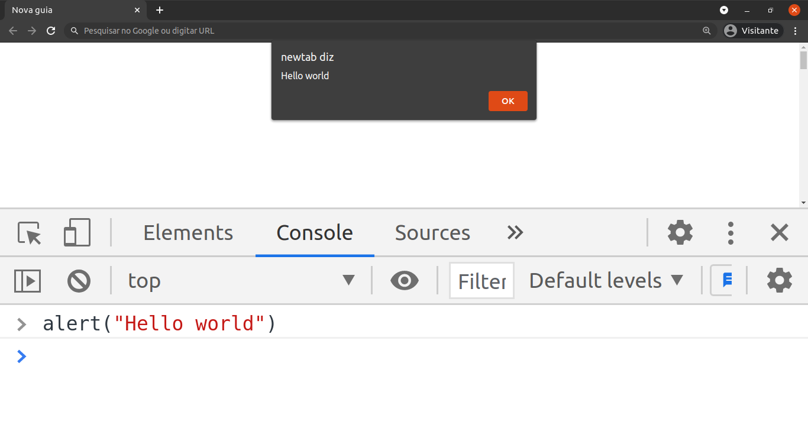

# JavaScript, a linguagem dos navegadores

JavaScript é extremamente eficaz, uma das linguagens de programação mais utilizada atualmente. Ela pode ser utilizada em vários contextos, no frontend para adicionar interativadade ao seu site; no backend através do Node.js; em aplicativos para celulares, tanto APK para Android e IPA iOS (Apple); aplicações desktop disponíveis em Linux, Mac OS e Windows; em ambiente IoT (Internet of Things, Internet das Coisas).

Se você é ou vai ser um desenvolvedor web, é indispensável ter essa linguagem em seu currículo.

Sem mais delongas…

## O que de fato é o JavaScript?

JavaScript ou abreviado como JS é uma linguagem de programação dinâmica, usualmente usada para fornecer interatividade a páginas HTML. Em relação, há outras linguagens tem uma vantagem, não é necessário instalar nem configurar um ambiente complicado para usá-la. Qualquer computador que tenha um navegador instalado, já possuir um ambiente para executar um código JS.

Entendi…

### Mas aonde executo o código?

Usando um navegador moderno (Chrome, Firefox, Safari e Edge) têm a funcionalidade chamada Developer Tools (Ferramentas do Desenvolvedor). Nos meus exemplos estarei utilizando o [DevTools](https://medium.com/r/?url=https%3A%2F%2Fwww.alura.com.br%2Fconteudo%2Fchrome-devtools) do Chrome _(Figura 1)_, mas fiquei a vontade em utilizar os demais navegadores.

Podemos abrir o DevTools de duas formas:

1. Clique no menu no canto superior direito, Mais ferramentas -> Ferramentas do Desenvolvedor.

1. Aperte o atalho `Ctrl+Shift+I`.

Ao abrir o DevTools, você verá a aba **Console** e permitirá escrever todo o seu código JavaScript na linha de comando _(Figura 2)_, atenção, para executar o código-fonte, é preciso apertar _Enter_:

