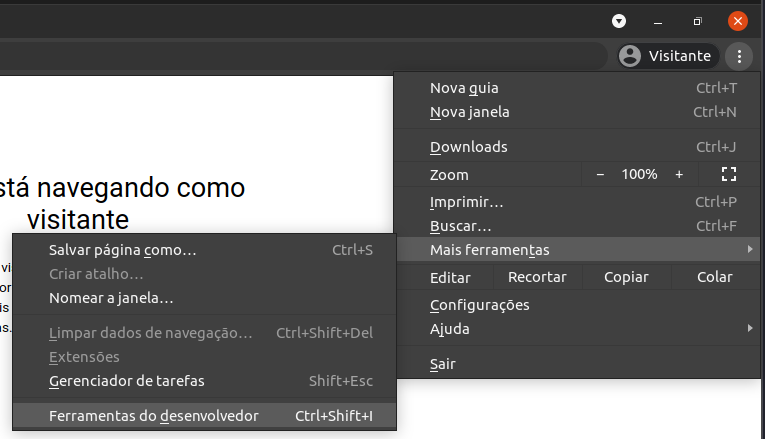
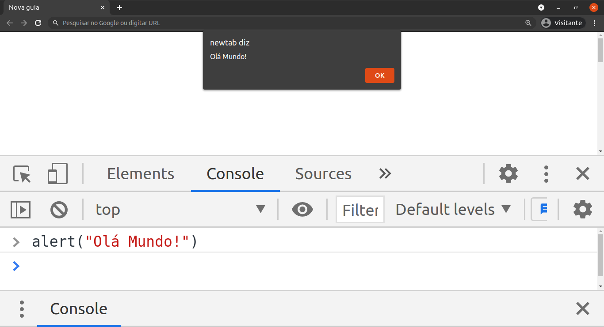

# JavaScript, a linguagem dos navegadores


_Imagem de [Markus Spiske](https://pixabay.com/pt/users/markusspiske-670330/?utm_source=link-attribution&amp;utm_medium=referral&amp;utm_campaign=image&amp;utm_content=1486361) por [Pixabay](https://pixabay.com/pt/?utm_source=link-attribution&amp;utm_medium=referral&amp;utm_campaign=image&amp;utm_content=1486361)_

JavaScript é extremamente eficaz, uma das linguagens de programação mais utilizada atualmente. Ela pode ser utilizada em vários contextos, no frontend para adicionar interativadade ao seu site; no backend através do Node.js; em aplicativos para celulares, tanto APK para Android e IPA iOS (Apple); aplicações desktop disponíveis em Linux, Mac OS e Windows; em ambiente IoT (Internet of Things, Internet das Coisas).

Se você é ou vai ser um desenvolvedor web, é indispensável ter essa linguagem em seu currículo.

Sem mais delongas…

## O que de fato é o JavaScript?

JavaScript ou abreviado como JS é uma linguagem de programação dinâmica, usualmente usada para fornecer interatividade a páginas HTML. Em relação, há outras linguagens tem uma vantagem, não é necessário instalar nem configurar um ambiente complicado para usá-la. Qualquer computador que tenha um navegador instalado, já possuir um ambiente para executar um código JS.

Entendi…

### Mas aonde executo o código?

Usando um navegador moderno (Chrome, Firefox, Safari e Edge) têm a funcionalidade chamada Developer Tools (Ferramentas do Desenvolvedor). Nos meus exemplos estarei utilizando o [DevTools](https://medium.com/r/?url=https%3A%2F%2Fwww.alura.com.br%2Fconteudo%2Fchrome-devtools) do Chrome _(Figura 1)_, mas fiquei a vontade em utilizar os demais navegadores.

Podemos abrir o DevTools de duas formas:

1. Clique no menu no canto superior direito, Mais ferramentas -> Ferramentas do Desenvolvedor.


_Figura 1_

2. Aperte o atalho `Ctrl+Shift+I`.

Ao abrir o DevTools, você verá a aba **Console** e permitirá escrever todo o seu código JavaScript na linha de comando _(Figura 2)_, atenção, para executar o código-fonte, é preciso apertar _Enter_:


_Figura 2_

Vamos fazer o nosso primeiro código, ou script. Temos duas maneiras de executar JavaScript em uma página HTML. Necessitamos criar um arquivo HTML ([_ola-mundo-v1.html_](./ola-mundo-v1.html)), o exemplo abaixo declaramos um tag script no arquivo HTML e, dentro da tag, colocar o código JavaScript. Agora, basta você rodar o arquivo HTML no seu navegador.


```html
<!DOCTYPE html>
<html lang="pt-br">
  <head>
    <meta charset="UTF-8">
    <title>Olá mundo!</title>
  </head>
  <body>
    <script>
      console.log("Olá Mundo!");
      alert("Olá Mundo!");
    </script>
  </body>
</html>
```

A segunda maneira, é criar um arquivo JavaScript ([_ola-mundo-v2.js_](./ola-mundo-v2.js)) e, adicionar o código JavaScript abaixo.

```js
console.log("Olá Mundo!");
alert("Olá Mundo!");
```

O arquivo HTML ([_ola-mundo-v2.html_](./ola-mundo-v2.html)) é semelhante ao arquivo HTML anterior, porém importamos o código JavaScript através da tag script. **Importante**, o arquivo HTML e JavaScript precisam está na mesma pasta, ou muda o caminho para pasta do arquivo JavaScript.

```html
<!DOCTYPE html>
<html lang="pt-br">
  <head>
    <meta charset="UTF-8">
    <title>Olá mundo!</title>
  </head>
  <body>
    <script src="ola-mundo-v2.js"></script>
  </body>
</html>
```

As duas maneiras executam o código de forma semelhante, retornando a mesma saída. Com tudo, o segundo exemplo é o mais usado pelos desenvolvedores JavaScript.

No [próximo artigo](../2-javascript-variaveis-escopo-operadores/README.md), vamos conversar sobre variável, escopo das variáveis e operadores.

### Referências Bibligráficas:
- [MDN Web docs](https://developer.mozilla.org/pt-BR/docs/Learn/Getting_started_with_the_web/JavaScript_basics)
- [Livro Estruturas de dados e algoritmos com JavaScript — Groner, L](https://www.google.com.br/books/edition/Estruturas_de_dados_e_algoritmos_com_Jav/0nWKDwAAQBAJ?hl=pt-BR)
