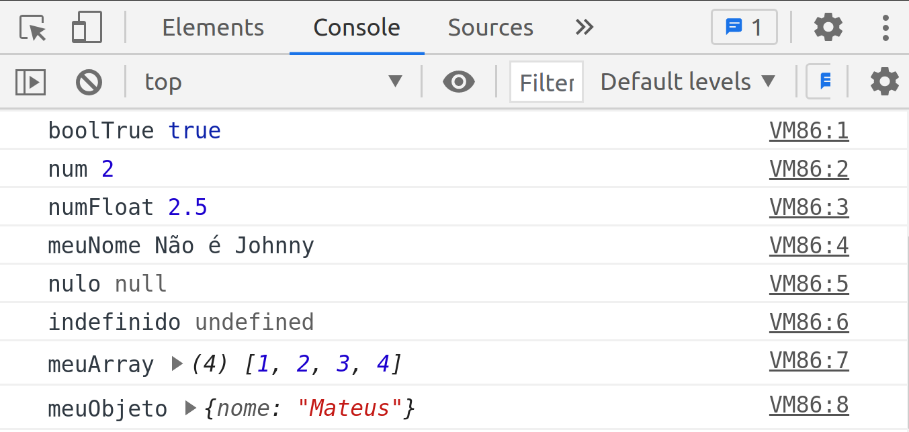
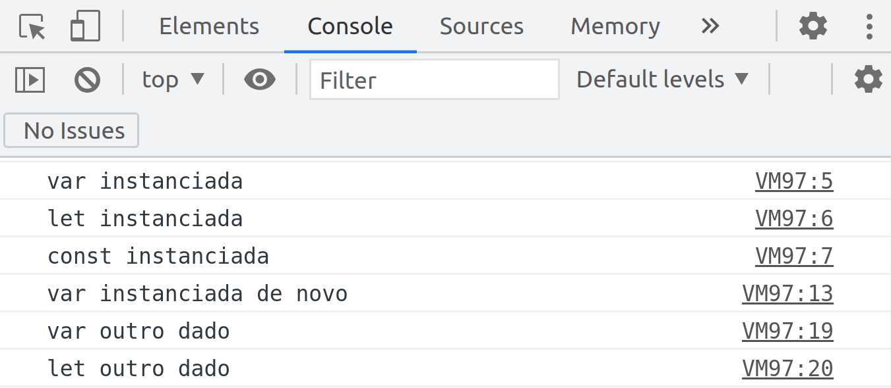

# Começando no mundo JavaScript - Variáveis e seus escopos e Operadores


_Imagem de [Alexas Fotos](https://pixabay.com/pt/users/alexas_fotos-686414/?utm_source=link-attribution&amp;utm_medium=referral&amp;utm_campaign=image&amp;utm_content=3094035) por [Pixabay](https://pixabay.com/pt/?utm_source=link-attribution&amp;utm_medium=referral&amp;utm_campaign=image&amp;utm_content=3094035)_

## Variáveis

As variáveis são espaços de memória onde armazenam dados, podendo ser definidos, atualizados, recuperados quando necessário. Para declarar uma variável podemos utilizar uma palavra-chave `var`, `let` ou `const` seguida por quase qualquer nome que deseja chama-lá. 

> Obs.: Em JavaScript existem algumas palavras reservadas que não podem ser utilizadas para nomear uma variável, confirar neste [link](https://mothereff.in/js-variables) se sua variável tem um nome válido.

Antes de mostrar-te um exemplo de declaração de variável, vamos primeiro entender os tipos de váriaveis:

* **boolean** (booleano);
* **number** (número);
* **string** (texto);
* **function** (função);
* **object** (objeto);
* **array**;
* **undefined** (indefinido);
* **null** (nulo);

```js
var boolTrue = true; // {1}
var num = 1; // {2}
var numFloat = 1.3; // {3}
var meuNome = "Mateus"; // {4}
var nulo = null; // {5}
var indefinido; // {6}
var meuArray = [1, 2, 3, 4]; // {7}
var meuObjeto = {
  nome: "Mateus",
}; // {8}
meuNome = "Não é Johnny"; // {9}
num = 2; // {10}
numFloat = 2.5; // {11}

console.log("boolTrue", boolTrue);
console.log("num", num);
console.log("numFloat", numFloat);
console.log("meuNome", meuNome);
console.log("nulo", nulo);
console.log("indefinido", indefinido);
console.log("meuArray", meuArray);
console.log("meuObjeto", meuObjeto);
```

Teste o exemplo acima no console do seu navegador. Terá um saída assim:


_Resultado do código [variaveis-tipo.js](./variaveis-tipo.js)_

* **{1}** Declaramos um booleano, para o JavaScript utilizar a palavra reservada var não é obrigatório, porém sua utilização é boa prática;
* **{2}** Declaramos um número;
* **{3}** Declaramos um número também, porém um float, ou seja, um número decimal de ponto flutuante;
* **{4}** Declaramos um string;
* **{5}** Declaramos um valor null, ou seja, sem valor;
* **{6}** Declaramos um undefined, é diferente de null. Undefined significa uma variável declarada, mas não recebeu nenhum;
* **{7}** Declaramos um array com 4 posições e cada posição contendo um número;
* **{8}** Declaramos um objeto com um atributo nome com uma string como valor;
* **{9}** A variável meuNome atualizada com a string "Não é Johnny";
* **{10}** A variável num atualizada com o número 2;
* **{11}** A variável numFloat atualizada com o float 2.5;

>Obs.: Como o JavaScript não é fortemente tipado. Isso significa que podemos declarar uma variável, como número e posteriormente atualizá-la com uma string ou outro tipo de dado. Esse tipo de operação não é considerado uma boa prática.

### Entendi… Mas você não falou qual é a diferença entre `var`, `let` ou `const`?

Calma, meu amigo… Irei explicar na próxima seção.


_Foto de [Sound On](https://www.pexels.com/pt-br/@sound-on?utm_content=attributionCopyText&utm_medium=referral&utm_source=pexels) no [Pexels](https://www.pexels.com/pt-br/foto/mulher-usando-oculos-vr-pretos-3761267/?utm_content=attributionCopyText&utm_medium=referral&utm_source=pexels)_

### Tipo de declarações de variáveis

```js
var variavelVar = "var instanciada";
let variavelLet = "let instanciada";
const variavelConst = "const instanciada";

console.log(variavelVar); // {1}
console.log(variavelLet); // {2}
console.log(variavelConst); // {3}

var variavelVar = "var instanciada de novo"; // {4}
// let variavelLet = 'let instanciada de novo'; {5}
// const variavelConst = 'const instanciada de novo'; {6}

console.log(variavelVar);

variavelVar = "var outro dado"; // {7}
variavelLet = "let outro dado"; // {8}
// variavelConst = 'const outro dado'; {9}

console.log(variavelVar);
console.log(variavelLet);
```
Teste o exemplo acima no console do seu navegador. Terá um saída assim:


_Resultado do código [variavel-tipo-2.js](./variavel-tipo-2.js)_

* **{1}** A variável `variavelVar` é instanciada com valor _var instanciada_;
* **{2}** A variável `variavelLet` é instanciada com valor _let instanciada_;
* **{3}** A variável `variavelConst` é instanciada com valor _const instanciada_;
* **{4}** A variável `variavelVar` é instanciada novamente com valor var _instanciada de novo_;
* **{5}** Se a linha não estivesse comentada, o compilador daria esse erro _"SyntaxError: Identifier 'variavelLet' has already been declared."_, pararia o código neste ponto, ou seja, uma variável do tipo `let` só pode se declarada uma única vez;
* **{6}** O mesmo ocorre nesta linha, o erro _"SyntaxError: Identifier 'variavelConst' has already been declared."_ é notificado pelo compilador e código não segue para a próxima linha ou seja, uma variável do tipo `const` só pode se declarada uma única vez;
* **{7}** A variável `variavelVar` recebe o valor _var outro valor_;
* **{8}** A variável `variavelLet` recebe o valor _let outro valor_;
* **{9}** Se a linha não estivesse comentada, o compilador daria esse erro _"TypeError: Assignment to constant variable.",_ pararia o código neste ponto, ou seja, uma variável do tipo const só pode ter um valor atribuído a ela quando ela é declarada.

### Escopo de variáveis
Basicamente, o escopo é o local em que podemos acessar a variável no algoritmo. Podemos ter variáveis **locais** ou **globais**.

///Gists de escopo de váriaveis

///Texto explicando o gists

No [próximo artigo](../3-operadores/README.md), vamos conversar sobre operadores.

### Referências Bibligráficas:
- [MDN Web docs](https://developer.mozilla.org/pt-BR/docs/Learn/Getting_started_with_the_web/JavaScript_basics)
- [Livro Estruturas de dados e algoritmos com JavaScript — Groner, L](https://www.google.com.br/books/edition/Estruturas_de_dados_e_algoritmos_com_Jav/0nWKDwAAQBAJ?hl=pt-BR)